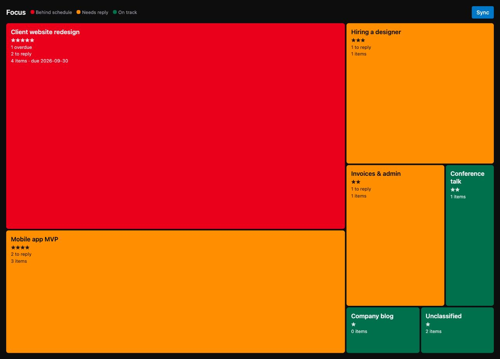

# kanban-treemap

**See which project needs you now, not which email is next.**

It reads Gmail, Google Chat and ClickUp Chat, uses AI to sort every message into *your* projects, and draws them as a treemap.



- **Bigger box**: the project matters more and has more waiting on you.
- 🔴 **Red**: the project deadline is close.
- 🟠 **Orange**: someone is waiting for your reply.
- 🟢 **Green**: on track.

Click a box to see its messages, urgent first, each with a one-line AI summary.

## Run it

Requires [uv](https://docs.astral.sh/uv/).

```sh
uvx --from git+https://github.com/avocadocutter/kanban-treemap kanban-treemap
```

Or install it once to get a short `kanban-treemap` command:

```sh
uv tool install git+https://github.com/avocadocutter/kanban-treemap
```

The first run creates `~/.kanban-treemap/` and prints step-by-step setup. You'll need:

- **AI**: your Claude Code or Codex (ChatGPT) login, or any OpenAI-compatible provider (Groq, OpenAI, Gemini, OpenRouter, or local Ollama)
- **Google**: an OAuth client from Google Cloud Console (about 10 minutes, once)
- **ClickUp**: a personal API token
- **Your projects**: a short `projects.yaml`, which the setup gives you a prompt to generate

## Privacy

Everything runs on your computer. Message excerpts are sent only to the AI provider you choose, or to nobody if you use Ollama. If you connect work accounts, check your company's AI policy first.

## Develop

`make dev` reads keys and ports from `~/.secrets/kanban-treemap.env` via [dotenvx](https://dotenvx.com).

```sh
make setup
make dev      # API + UI with hot reload
make test
make build    # rebuild the UI before committing UI changes
```

---

© 2026 avocadocutter. All rights reserved.
